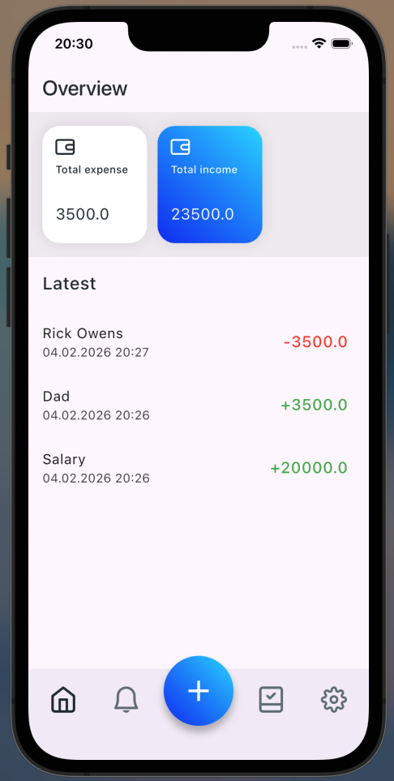
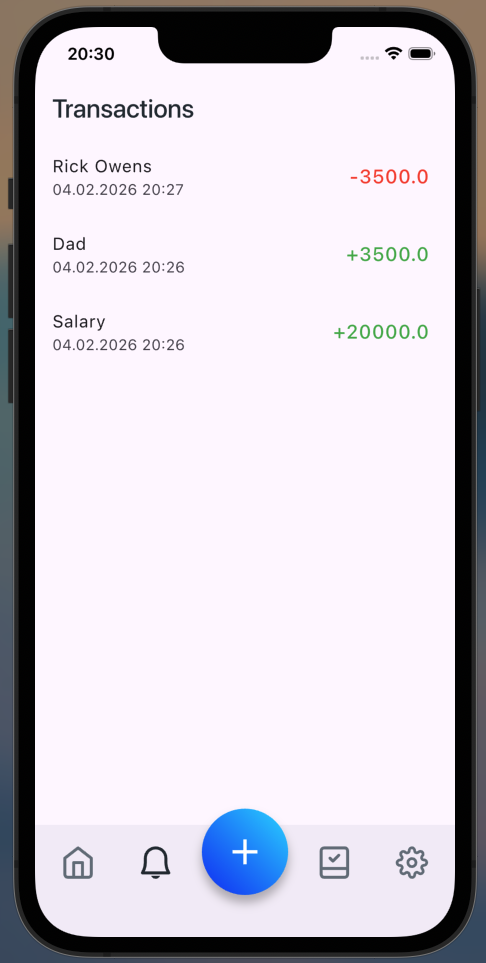
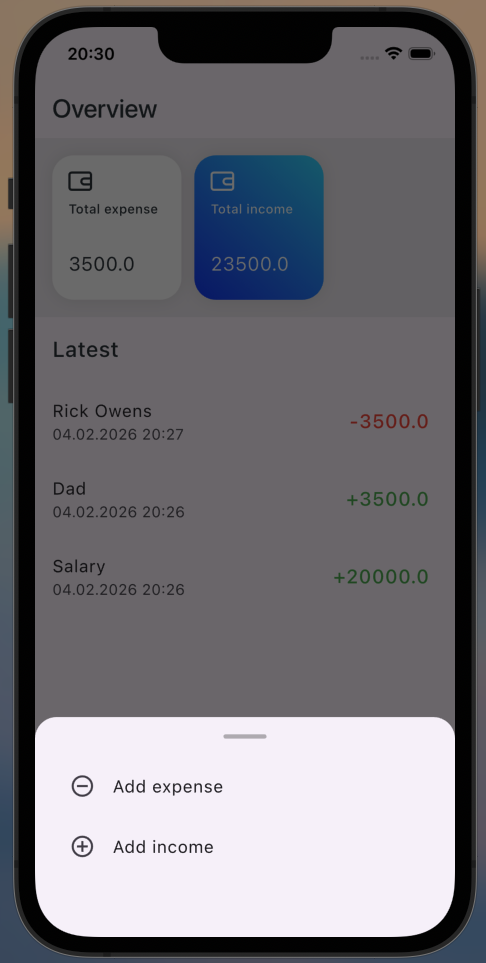
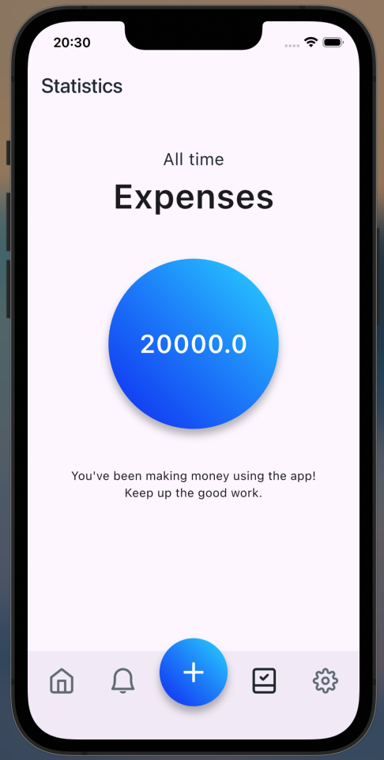
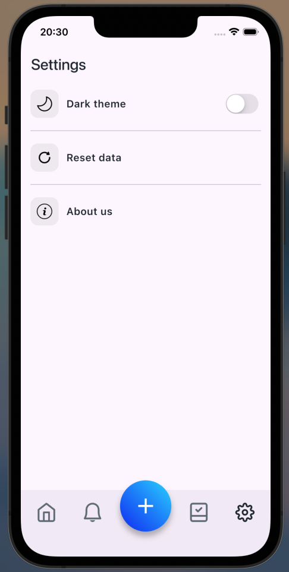
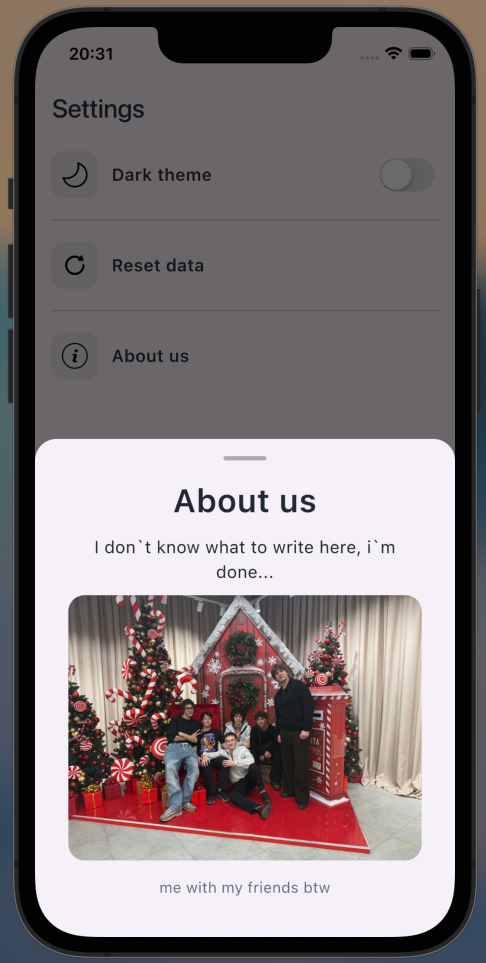
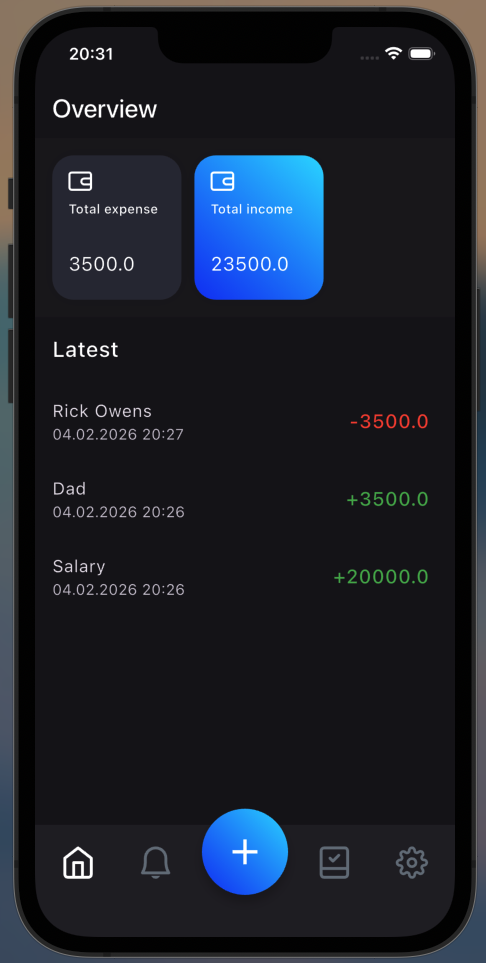
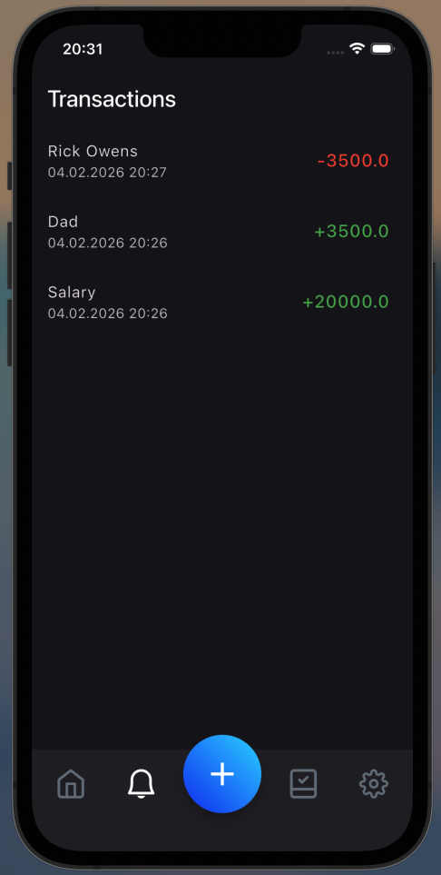
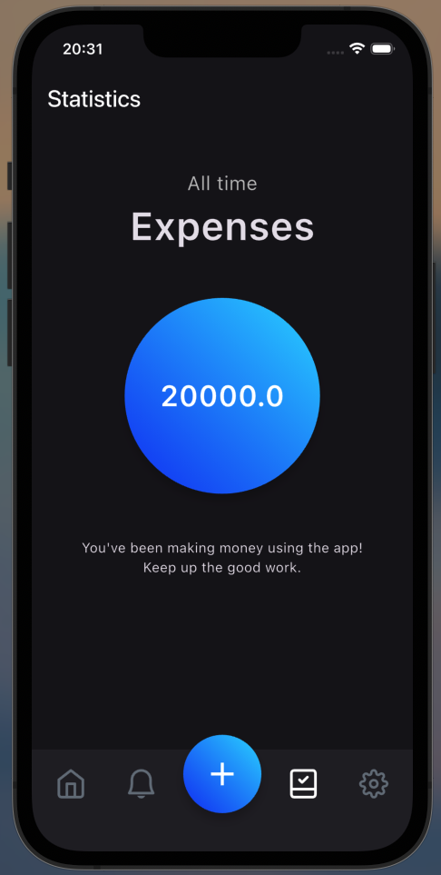
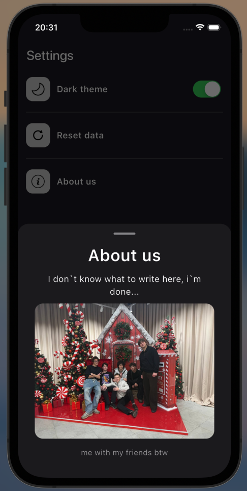

# moneytracker

- Offline-first and lightweight expense tracking application
- Built with Flutter for a smooth cross-platform experience
- State management powered by Riverpod
- Local data storage using Hive (no internet required)
- Supports light and dark themes
- Clean and scalable project architecture

## Screenshots

- Light Theme

  
  
  

  
  
  

- Dark Theme

  
  
  

  
  
  

